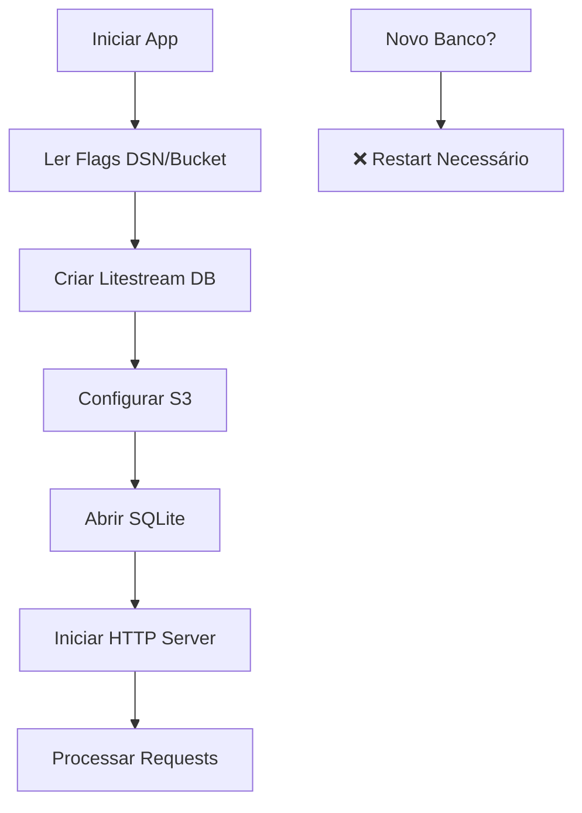
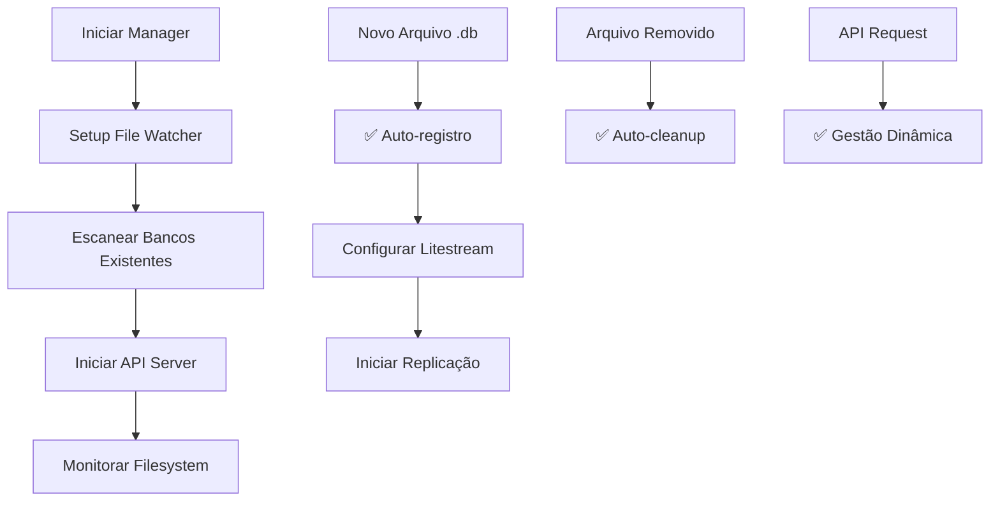

# Comparação: Sistema Atual vs Sistema Multitenente

## 📊 Visão Geral das Diferenças

| Aspecto | Sistema Atual | Sistema Multitenente |
|---------|---------------|---------------------|
| **Bancos por Instância** | 1 banco fixo | Múltiplos bancos dinâmicos |
| **Detecção** | Manual (flag) | Automática (file watcher) |
| **Configuração** | Estática | Dinâmica via API |
| **Organização S3** | `databases/{nome}/` | `tenants/{tenant}/{db}/` |
| **Gestão** | Restart necessário | Hot-reload automático |
| **API** | Apenas HTTP básico | REST API completa |
| **Monitoramento** | Logs básicos | Métricas por tenant |

## 🏗️ Arquitetura Comparativa

### Sistema Atual (Single Database)
```go
// main.go
func main() {
    dsn := flag.String("dsn", "", "datasource name")
    bucket := flag.String("bucket", "", "s3 replica bucket")
    
    // ❌ UMA instância por processo
    lsdb, err := replicate(ctx, *dsn, *bucket, finalDbName)
    
    // ❌ Path fixo configurado na inicialização
    db, err := sql.Open("sqlite3", *dsn)
}
```

### Sistema Multitenente (Multiple Databases)
```go
// multitenant-litestream.go
type DatabaseManager struct {
    databases  map[string]*litestream.DB  // ✅ Múltiplas instâncias
    configs    map[string]*TenantConfig   // ✅ Configuração por tenant
    watcher    *fsnotify.Watcher          // ✅ Detecção automática
    mutex      sync.RWMutex               // ✅ Thread-safe
}

func (dm *DatabaseManager) registerDatabase(dbPath string) error {
    // ✅ Registro dinâmico de novos bancos
    // ✅ Configuração automática S3
    // ✅ Sem restart necessário
}
```

## 🎯 Casos de Uso Suportados

### Sistema Atual - Ideal para:
- ✅ **Aplicações simples** com um banco
- ✅ **Microserviços** dedicados  
- ✅ **Prototipagem** rápida
- ✅ **Configuração mínima**

### Sistema Multitenente - Ideal para:
- ✅ **SaaS** com múltiplos clientes
- ✅ **Plataformas** multi-inquilino
- ✅ **Logs** temporais/dinâmicos
- ✅ **Ambientes** de desenvolvimento
- ✅ **Backup** de múltiplos projetos

## 🔄 Fluxo de Operação

### Sistema Atual


### Sistema Multitenente


## 📈 Performance e Recursos

### Sistema Atual
```yaml
Recursos:
  - CPU: Baixo (um processo)
  - Memória: ~10-50MB
  - Conexões S3: 1 ativa
  - Threads: 3-5

Limitações:
  - 1 banco por processo
  - Configuração estática
  - Restart para mudanças
```

### Sistema Multitenente
```yaml
Recursos:
  - CPU: Médio (múltiplos watchers)
  - Memória: ~50-200MB (dependendo de tenants)
  - Conexões S3: N ativas (por banco)
  - Threads: 10-50 (por tenant)

Capacidades:
  - 1000+ tenants por instância
  - 50+ bancos por tenant
  - Configuração dinâmica
  - Zero-downtime updates
```

## 🛠️ APIs Disponíveis

### Sistema Atual
```bash
# Apenas servidor HTTP básico
GET /                    # Page views counter
```

### Sistema Multitenante
```bash
# API completa de gestão
GET /api/health         # Status geral do sistema
GET /api/databases      # Lista todos os bancos
POST /api/databases     # Registra novo banco manualmente

# Resposta de exemplo
{
  "totalTenants": 5,
  "totalDatabases": 12,
  "activeTenants": ["tenant-001", "tenant-002"],
  "databases": [
    {
      "tenantId": "tenant-001",
      "databaseName": "users",
      "localPath": "/data/tenant-001/users.db",
      "s3Path": "s3://bucket/tenants/tenant-001/users/",
      "status": "active",
      "createdAt": "2025-01-15T10:30:45Z"
    }
  ]
}
```

## 📁 Estrutura S3 Comparativa

### Sistema Atual
```
bucket/
└── databases/
    ├── users/          # Database name only
    │   ├── snapshots/
    │   └── wal/
    └── products/
        ├── snapshots/
        └── wal/
```

### Sistema Multitenente
```
bucket/
└── tenants/
    ├── tenant-001/     # Tenant isolation
    │   ├── users/
    │   │   ├── snapshots/
    │   │   └── wal/
    │   └── orders/
    │       ├── snapshots/
    │       └── wal/
    └── tenant-002/
        └── products/
            ├── snapshots/
            └── wal/
```

## 🔐 Segurança e Isolamento

### Sistema Atual
- **Isolamento**: Nenhum (banco único)
- **Permissões**: Bucket-level apenas
- **Auditoria**: Logs básicos

### Sistema Multitenente  
- **Isolamento**: Por tenant + banco
- **Permissões**: Granulares por S3 prefix
- **Auditoria**: Logs estruturados com contexto
- **Rate Limiting**: Por tenant configurável

## 🚀 Migração do Sistema Atual

### Passo a Passo
```bash
# 1. Backup dados atuais
litestream restore -o backup.db s3://bucket/databases/current/

# 2. Criar estrutura tenant
mkdir -p /data/tenant-001/
mv backup.db /data/tenant-001/main.db

# 3. Iniciar sistema multitenente
./multitenant-litestream -bucket bucket -watch-path /data/

# 4. Verificar migração
curl http://localhost:8080/api/health
```

### Compatibilidade
- ✅ **Dados existentes** preservados
- ✅ **Restauração** funciona normalmente  
- ✅ **S3 paths** reorganizados automaticamente
- ✅ **Zero downtime** se configurado corretamente

## 📊 Quando Usar Cada Sistema

### Use Sistema Atual quando:
- 🎯 **Aplicação simples** com banco único
- 🎯 **Recursos limitados** (CPU/Memória)
- 🎯 **Setup rápido** sem configuração complexa
- 🎯 **Microserviço** dedicado

### Use Sistema Multitenente quando:
- 🎯 **SaaS/Multi-tenant** architecture
- 🎯 **Múltiplos projetos** no mesmo servidor
- 🎯 **Bancos dinâmicos** criados em runtime
- 🎯 **Gestão centralizada** necessária
- 🎯 **Monitoramento** granular requerido
- 🎯 **APIs** de controle importantes

## 🎯 Recomendação de Implementação

Para **cenários multitenente com SQLite dinâmico**, o sistema expandido oferece:

1. **✅ Detecção automática** de novos bancos
2. **✅ API de controle** completa  
3. **✅ Organização hierárquica** no S3
4. **✅ Monitoramento** por tenant
5. **✅ Escalabilidade** horizontal
6. **✅ Zero-downtime** operations

O investimento em complexidade adicional compensa pelos benefícios de **gestão dinâmica** e **isolamento por tenant**. 